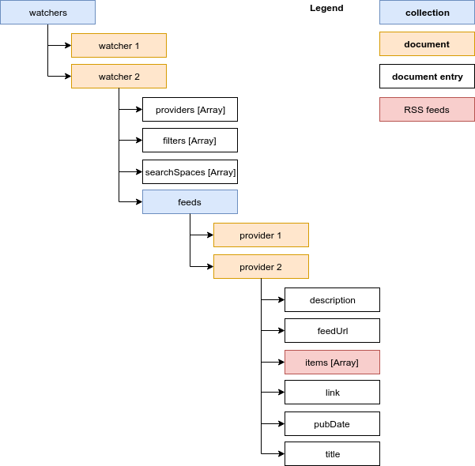

# RSS filter
Watch, parse, filter and save RSS feeds.

## Usage

```bash
node index.js  -d 'https://yourDbId.firebaseio.com' -k path/to/your/api/key -i 600000
```
__Options :__

* __-d__ : Set database URL.
* __-i__ : Set refresh interval in ms.
* __-k__ : Path to your firebase API key.
* __-s__ : Use the safe regex mode, and prevent regex catastrophic backtracking.

## Install

__From npm__

```
npm install -g rss-filter
```

__From github__

```bash
  git clone http://
  cd rss-filter/
  npm install
  npm link
```
__Dependencies :__

* [node](https://nodejs.org/en/)
* [npm](https://www.npmjs.com/get-npm)

## Quickstart
### Setup

RSS Filter relies on firebase, you need to create an account on [Firebase](https://console.firebase.google.com/) web site, and setup a new [Firecloud database](https://firebase.google.com/docs/firestore/quickstart).

Then create a [private api key](https://console.firebase.google.com/project/_/settings/serviceaccounts/adminsdk), select your database, and save your API key.

Then create new watchers (see watchers example).

### Watchers example
```json
{
  "providers": [
    "http://www.lemonde.fr/rss/une.xml",
    "http://www.lefigaro.fr/rss/figaro_actualites.xml"
  ],
  "filters" : [
    "GAFAM",
    "GAFA",
    "/Regular expression/"
  ],
  "searchSpaces" : [
    "content",
    "title"
  ]
}
```

__Available search spaces :__

* content
* contentSnippet
* enclosure.lenght
* enclosure.type
* enclosure.url
* guid
* isoDate
* link
* pubDate
* title

__Filters :__

* Filter can be either a string or a regular expression. Regulars expression are written betwen slashes.

* Filters are casse sensitive.

* Prevent regex “[Catastrophic Backtracking”](http://regular-expressions.mobi/catastrophic.html) `node index.js -s` or `node index.js -safe-regex`

### Refresh interval
RSS filter fetch feeds at fixed interval, nevertheless updating a watchers in your database will automaticaly refetch rss feeds.

## Data structure



### Where does my rss feeds are stored ?

For each of your watchers, Rss filter stores filtered rss feeds in a sub collection named “feeds”. Feeds collection is organised by providers (see [Datastructure](#Data structure)).

## License

MIT
